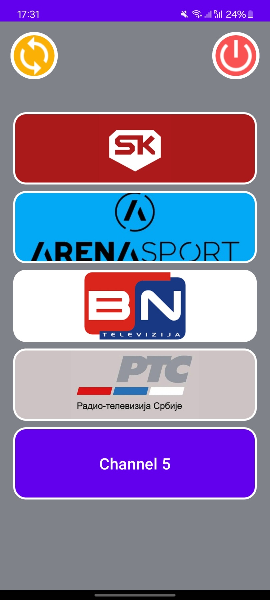
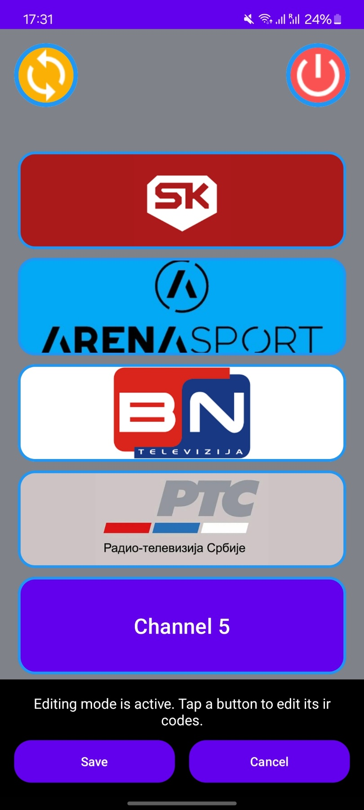

# Simple TV Remote for Elderly

## Project Overview
This app is currently in development and should not be used yet. It is a personal project designed for my grandfather, and many aspects, including UI elements and Broadlink integration, are still being refined. Some images are currently hardcoded and will be optimized in future updates.

## Features
- Minimalist, large-button interface optimized for senior users
- 5 preset TV channels for quick and simple navigation
- Broadlink device integration for seamless remote control
- High-contrast design for better visibility
- Large, clear text and icons

## Requirements
- Android 7.0+ (Nougat)
- Broadlink RM Mini or compatible IR blaster device
- Internet connection for initial device setup

## Installation
1. Clone the repository
2. Open in Android Studio
3. Configure Broadlink device credentials
4. Build and install on target device

## Planned Improvements
- Additional accessibility features
- Customizable button sizes
- More channel presets
- Changeable button icons

## Screenshots
Below are two screenshots of the current UI:

    &nbsp;&nbsp;&nbsp;&nbsp;
    

## Acknowledgements
This project uses a modified version of the [broadlink-java-api](https://github.com/a1aw/broadlink-java-api) library originally created by [a1aw](https://github.com/a1aw). As the original library was not maintained, I've forked and updated it to work with newer versions of Java and Kotlin. The updated library can be found at [ognjenvujovic04/broadlink-java-api](https://github.com/ognjenvujovic04/broadlink-java-api).

## License
MIT License

## Contributing
Pull requests are not welcome at the moment
